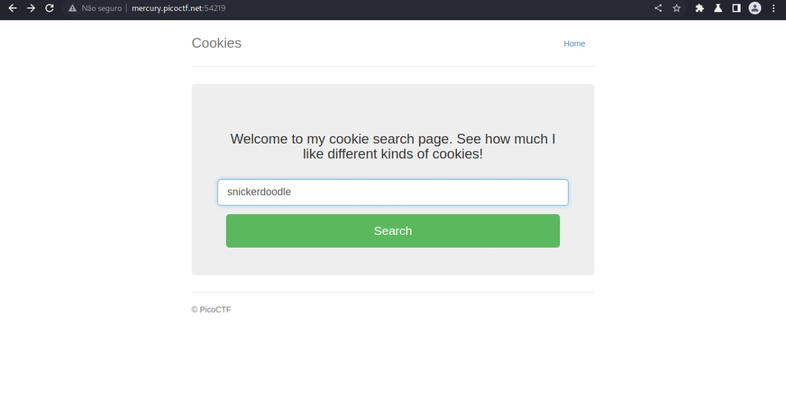
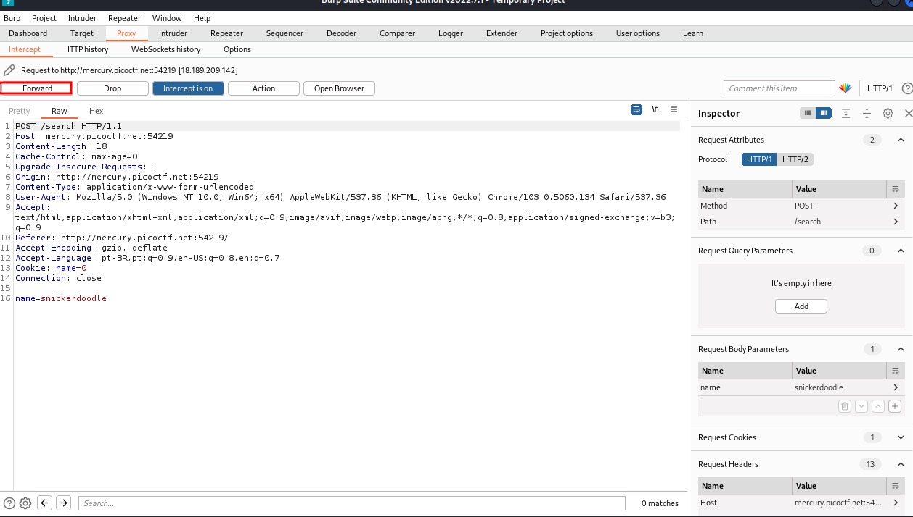
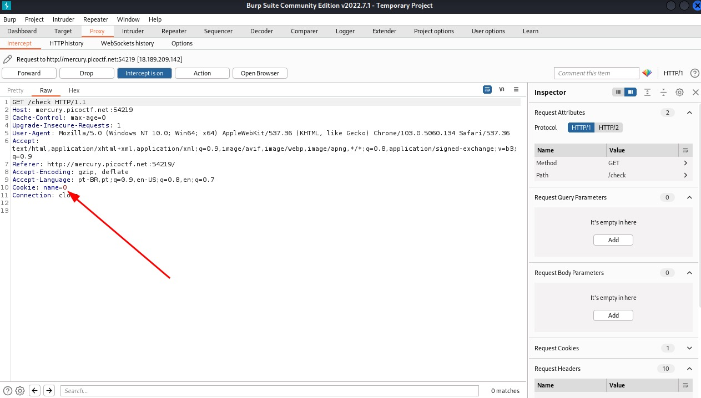
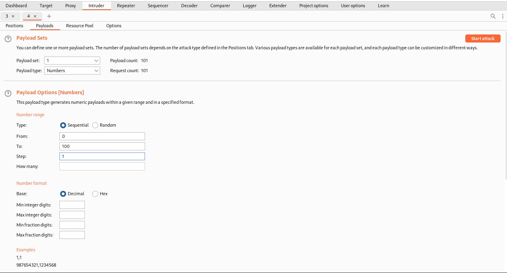
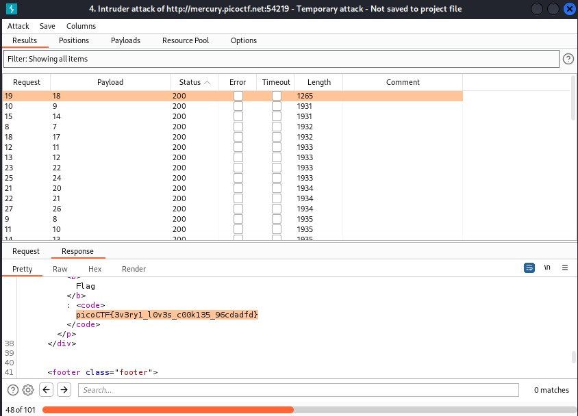

# Laborátorio Cookies do picoCTF

Esse laborátorio Cookies do picoCTF tem como objetivo fazer com que o pentester aprenda a manipular os cookies em questão, aqui utilizarei o burp e com a opção de intruder para capturar a flag em questão.

# Requisitos para invasão
- [x] BurpSuite

# Tela inicial do Lab

Aqui vemos um input que tem uma sugestão para colocar um cookie "snickerdoodle", não esqueçam de deixar o burp com o intercept on

# Interceptando requisição
Aqui encontramos a requisição no burp, tem o campo do cookie ali, que poderia ser usado para mais tarde um bruteforce, vamos passar a requisição para ver se tem outra coisa legal.

# Achamos o cookie aqui
Aqui na segunda requisição achamos o campo cookie, e ele tem o valor 0, provavelmente porque é o primeiro cookie, vamos realizar um bruteforce nesse campo, iremos jogar essa requisição no intruder

# Configurar o intruder
E como vimos que o cookie era "0" o padrão deve ser números inteiros.

Vamos configurar para um bruteforce de 0 a 100

# Key encontrada
Filtrando pelo tamanho da requisição e o status 200, achamos a key do CTF

