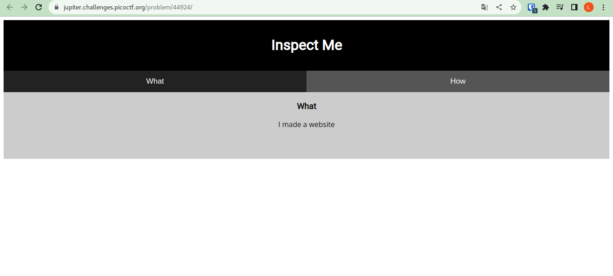

# Laborátorio Insp3ct0r do picoCTF

O objetivo do Laborátorio é conhecer a estrutura básico de um site: HTML,css e Javascript


## AUTHOR
ZARATEC/DANNY


## Description

Kishor Balan tipped us off that the following code may need inspection: https://jupiter.challenges.picoctf.org/problem/44924/ (link) or http://jupiter.challenges.picoctf.org:44924

# Requisitos para invasão
- [x] Navegador


# Tela inicial
Depois de entrar no site, tive a curiosidade de abrir o código fonte para buscar por novas informações do site



#### HTML code
```html

<!doctype html>
<html>
  <head>
    <title>My First Website :)</title>
    <link href="https://fonts.googleapis.com/css?family=Open+Sans|Roboto" rel="stylesheet">
    <link rel="stylesheet" type="text/css" href="mycss.css">
    <script type="application/javascript" src="myjs.js"></script>
  </head>

  <body>
    <div class="container">
      <header>
	<h1>Inspect Me</h1>
      </header>

      <button class="tablink" onclick="openTab('tabintro', this, '#222')" id="defaultOpen">What</button>
      <button class="tablink" onclick="openTab('tababout', this, '#222')">How</button>
      
      <div id="tabintro" class="tabcontent">
	<h3>What</h3>
	<p>I made a website</p>
      </div>

      <div id="tababout" class="tabcontent">
	<h3>How</h3>
	<p>I used these to make this site: <br/>
	  HTML <br/>
	  CSS <br/>
	  JS (JavaScript)
	</p>
	<!-- Html is neat. Anyways have 1/3 of the flag: picoCTF{tru3_d3 -->
      </div>
      
    </div>
    
  </body>
</html>

```

Vocês conseguiram achar a flag no código? 

Antes de comentar sobre a flag, quero que vocês guardem bem esses dois arquivos.

```html
    <link rel="stylesheet" type="text/css" href="mycss.css">
    <script type="application/javascript" src="myjs.js"></script>
```

E a flag está na linha comentada do html

```
	<!-- Html is neat. Anyways have 1/3 of the flag: picoCTF{tru3_d3 -->
```

Vamos ganhar essa primeira parte para somar com as outras flags: picoCTF{tru3_d3


Essa falha tenta simular caso um desenvolvedor comente algo sensível no código fonte, pensando que o usuário não irá conseguir ver, pois, o código comentado não é renderizado na página, mas, como o código fonte é enviado ao cliente, outras pessoas poderiam ver esse código caso simplesmente olhassem o código fonte da aplicação.


Vamos olhar o CSS também

```html
 <link rel="stylesheet" type="text/css" href="mycss.css">
```


#### CSS code
```html
div.container {
    width: 100%;
}

header {
    background-color: black;
    padding: 1em;
    color: white;
    clear: left;
    text-align: center;
}

body {
    font-family: Roboto;
}

h1 {
    color: white;
}

p {
    font-family: "Open Sans";
}

.tablink {
    background-color: #555;
    color: white;
    float: left;
    border: none;
    outline: none;
    cursor: pointer;
    padding: 14px 16px;
    font-size: 17px;
    width: 50%;
}

.tablink:hover {
    background-color: #777;
}

.tabcontent {
    color: #111;
    display: none;
    padding: 50px;
    text-align: center;
}

#tabintro { background-color: #ccc; }
#tababout { background-color: #ccc; }

/* You need CSS to make pretty pages. Here's part 2/3 of the flag: t3ct1ve_0r_ju5t */
```


Separando a flag para ficar de mais fácil visualização. 

```html
/* You need CSS to make pretty pages. Here's part 2/3 of the flag: t3ct1ve_0r_ju5t */
```

Agora a flag é : picoCTF{tru3_d3 + t3ct1ve_0r_ju5t

Vamos para o javascript


```html
<script type="application/javascript" src="myjs.js"></script>
```
#### JS code

```html
function openTab(tabName,elmnt,color) {
    var i, tabcontent, tablinks;
    tabcontent = document.getElementsByClassName("tabcontent");
    for (i = 0; i < tabcontent.length; i++) {
	tabcontent[i].style.display = "none";
    }
    tablinks = document.getElementsByClassName("tablink");
    for (i = 0; i < tablinks.length; i++) {
	tablinks[i].style.backgroundColor = "";
    }
    document.getElementById(tabName).style.display = "block";
    if(elmnt.style != null) {
	elmnt.style.backgroundColor = color;
    }
}

window.onload = function() {
    openTab('tabintro', this, '#222');
}

/* Javascript sure is neat. Anyways part 3/3 of the flag: _lucky?f10be399} */
```

Separando a ultima flag

```html
/* Javascript sure is neat. Anyways part 3/3 of the flag: _lucky?f10be399} */
```
e encontramos a ultima flag que é a : _lucky?f10be399}


Somando as flag encontramos a resposta: picoCTF{tru3_d3 + t3ct1ve_0r_ju5t +  _lucky?f10be399}
E está completa! 
Laborátorio finaliazado!