# Sala Startup do TryHackMe


# Description

We are Spice Hut, a new startup company that just made it big! We offer a variety of spices and club sandwiches (in case you get hungry), but that is not why you are here. To be truthful, we aren't sure if our developers know what they are doing and our security concerns are rising. We ask that you perform a thorough penetration test and try to own root. Good luck!


# Requisitos para invasão
- [x] Nmap
- [x] FTP
- [x] Ffuf
- [x] Alguma web shell php
- [x] nc


# Scan Inicial (3 portas abertas)

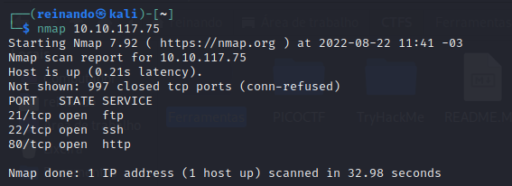


# FTP com usuario ftp habilitado
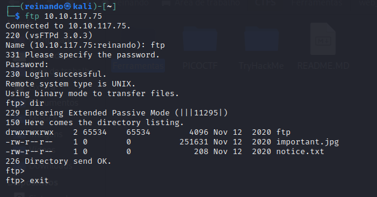

Tentei acessar esses arquivos via navegador e não consegui.

# Ffuf

Deixei o ffuf rodando e fui analisar os metadados da imagem

```
ffuf -c -w /usr/share/dirb/wordlists/common.txt -u http://10.10.117.75/FUZZ -e '.php','.html','.csv','.xls','.xlsx'
```

# Metadados da imagem

Usei o exiftool para descobrir metadados da imagem. Não encontrei nada e tentei descompactar a imagem


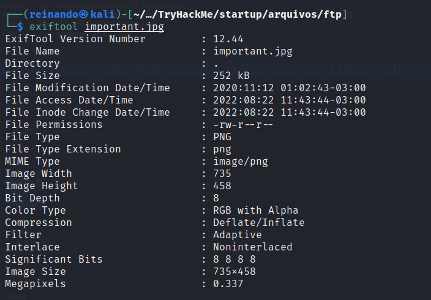


# Descompactando a imagem

Descompatei e tinha um arquivo vazio e um com formato de zlib, fui instalar a ferramenta zlib-flate para descomprimir.
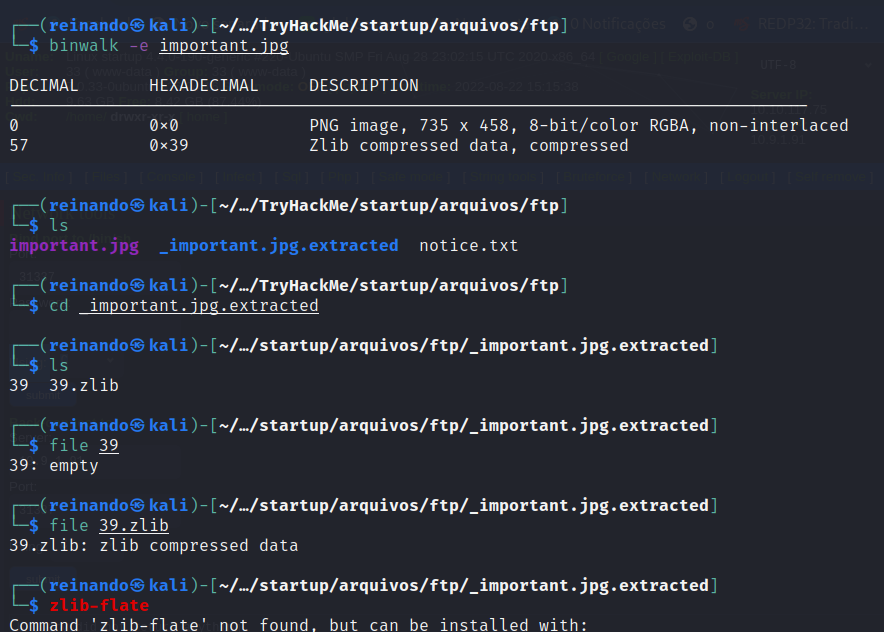


# Ffuf

Enquanto a ferramenta instalava, descobri que o resultado do ffuf tinha terminado e que achou um diretorio chamado files

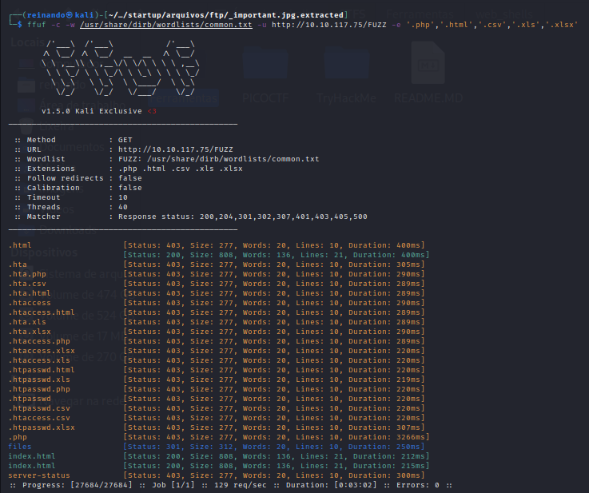

# Tela do files

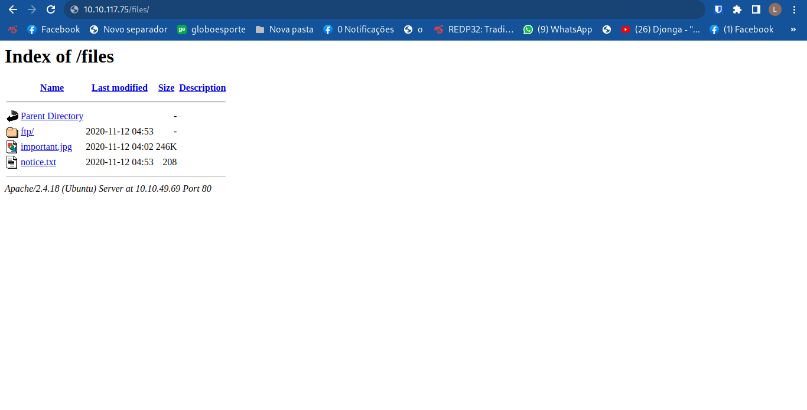


# Enviando web shell via ftp

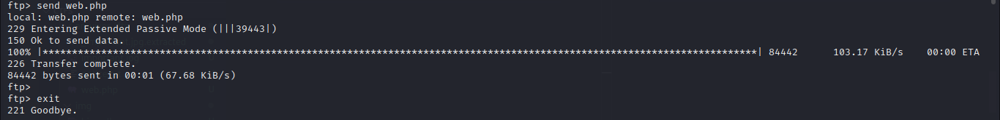


# WSO Web shell

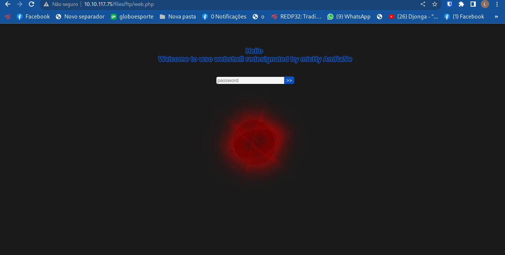


# Pegando shell via nc

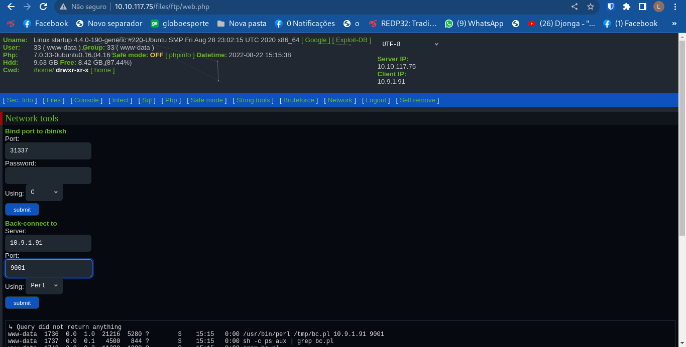

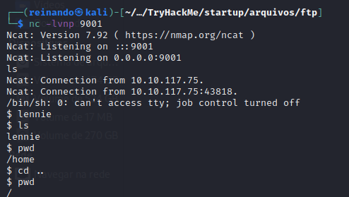

# Escalando privilegios

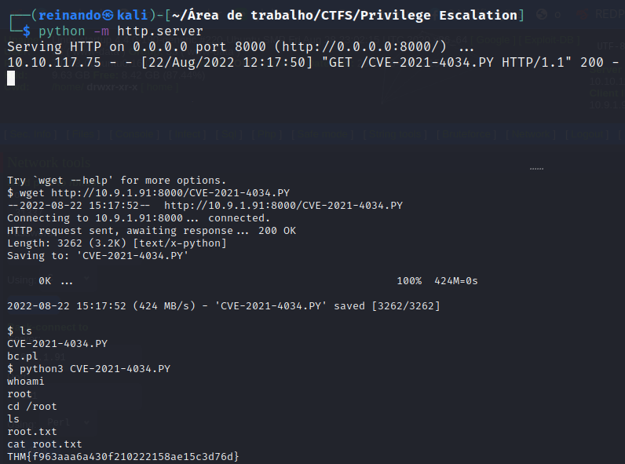


